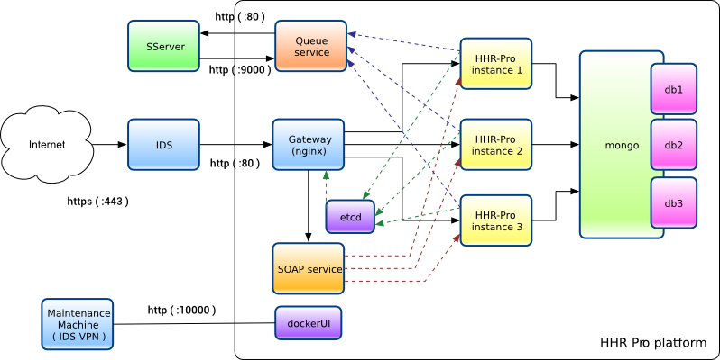

% Docker physiodom gateway  
% Fabrice Le Coz <fabrice.lecoz@telecomsante.com>  
% November, 2016

This docker act as a reverse proxy. The HHR-Pro instances register to the etcd instance, giving their IP, dns name, and language

example of an etcd record :

    '{"dns":"hhrpro-test.physiodom.eu","lang":"en","ip":"172.18.0.4"}'

the IP is the IP of the container

Then the gateway watches for change into the etcd registry, and rewrite the nginx configuration when a new value appears into `/services/HHR-Pro`

# create the image

docker build -t physiodom-gw .

# run the container

the container needs an etcd instance to run :

    docker run -d --restart=always \
           --name etcd \
           physiodom/etcd

Then run the container

    docker run -d --restart=always \
           --name gateway
           --link etcd
           --port 80:80
           physiodom-gw
